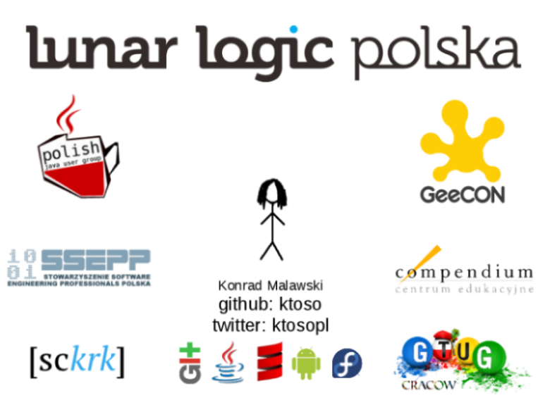
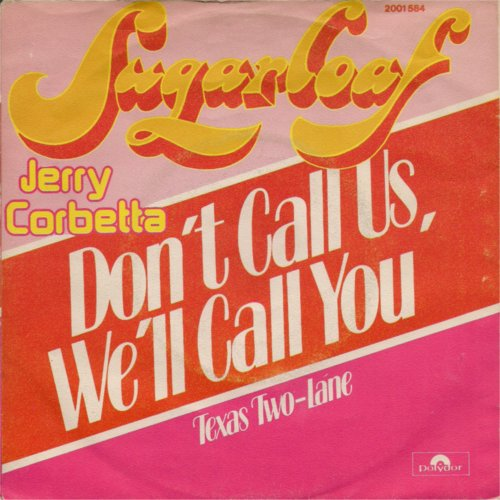

Deep dive into RoboGuice
=========

  beyond "Hello World apps"

---

about("Konrad Malawski")
========================

---

Does your Activity look like this?
==================================

    !java
    public class CracowMobiActivity extends Activity {

      Twitter twitter;

      EditText msg;
      ListView tweets;
      Button send;
      TextView hello;

      LayoutInflater inflater;

      @Override
      public void onCreate(Bundle savedInstanceState) {
        super.onCreate(savedInstanceState);

        twitter = new FastTwitter();

        setContentView(R.layout.main);
        
        msg = (EditText) findViewById(R.id.msg);
        tweets = (ListView) findViewById(R.id.tweets);
        send = (Button) findViewById(R.id.send);
        hello = (TextView) findViewById(R.id.hello);

        // magic string alert!
        inflater = (LayoutInflater) getSystemService(LAYOUT_INFLATER_SERVICE);
      }
    }

---

Me.sad(true)
============

---

IoC && DI
====================

- Inversion of Control

- Dependency Injection

---

Inversion of Control
====================

The hollywood principle
----------------------

---

Dependency Injection in Java
============================

---

JSR-330
=======

Dependency Injection in Java

     
     
     
See: [JSR-330 Specification](http://code.google.com/p/atinject/)

---

@Inject
============================

---

A simple example
================

## Bad:

    !java
    class Clazz {
      Twitter twitter;

      public Clazz() {
        twitter = new Twitter();
      }
    }

---

A simple example (field injection)
================

## Bad:

    !java
    class Clazz {
      Twitter twitter;

      public Clazz() {
        twitter = new Twitter();
      }
    }

## Better: 
      
    !java
    class Clazz {

      @Inject
      Twitter twitter;
       
      public Clazz() {}
    }

---

A simple example (constructor injection)
================

## Better: 
      
    !java
    class Clazz {

      @Inject
      Twitter twitter;
       
      public Clazz() {}
    }

## Better (cleaner) (but has boilerplate): 
      
    !java
    class Clazz {

      Twitter twitter;
       
      @Inject
      public Clazz(Twitter twitter) {
        this.twitter = twitter;
      }
    }

The "cleanest solution"

---

A simple example (setter injection)
================

## Better: 
      
    !java
    class Clazz {

      @Inject
      Twitter twitter;
       
      public Clazz() {}
    }

## Also ok (but has boilerplate): 
      
    !java
    class Clazz {

      Twitter twitter;
       
      public Clazz() {    }

      @Inject
      public setTwitter(Twitter twitter) {
        this.twitter = twitter;
      }
    }

---

Google Guice
============

---

Google Guice
============

- **Dependency Injection** Framework
- JSR-330 compatible (mostly)

--- 

JSR-330 vs. Guice
=================

<table class="wikitable"><tbody><tr><td style="border: 1px solid #ccc; padding: 5px;"> <strong>JSR-330</strong> javax.inject </td><td style="border: 1px solid #ccc; padding: 5px;"> <strong>Guice</strong>  com.google.inject </td><td style="border: 1px solid #ccc; padding: 5px;">  </td></tr> <tr><td style="border: 1px solid #ccc; padding: 5px;"> 89<a href="http://atinject.googlecode.com/svn/trunk/javadoc/javax/inject/Inject.html" rel="nofollow" keynav:shortcut="90">@Inject</a> </td><td style="border: 1px solid #ccc; padding: 5px;"> 90<a href="http://google-guice.googlecode.com/svn/trunk/latest-javadoc/com/google/inject/Inject.html" rel="nofollow" keynav:shortcut="91">@Inject</a> </td><td style="border: 1px solid #ccc; padding: 5px;"> Interchangeable (almost). </td></tr> <tr><td style="border: 1px solid #ccc; padding: 5px;"> 91<a href="http://atinject.googlecode.com/svn/trunk/javadoc/javax/inject/Named.html" rel="nofollow" keynav:shortcut="92">@Named</a> </td><td style="border: 1px solid #ccc; padding: 5px;"> 92<a href="http://google-guice.googlecode.com/svn/trunk/latest-javadoc/com/google/inject/name/Named.html" rel="nofollow" keynav:shortcut="93">@Named</a> </td><td style="border: 1px solid #ccc; padding: 5px;"> Interchangeable.  </td></tr> <tr><td style="border: 1px solid #ccc; padding: 5px;"> 93<a href="http://atinject.googlecode.com/svn/trunk/javadoc/javax/inject/Qualifier.html" rel="nofollow" keynav:shortcut="94">@Qualifier</a> </td><td style="border: 1px solid #ccc; padding: 5px;"> 94<a href="http://google-guice.googlecode.com/svn/trunk/latest-javadoc/com/google/inject/BindingAnnotation.html" rel="nofollow" keynav:shortcut="95">@BindingAnnotation</a> </td><td style="border: 1px solid #ccc; padding: 5px;"> Interchangeable. </td></tr> <tr><td style="border: 1px solid #ccc; padding: 5px;"> 95<a href="http://atinject.googlecode.com/svn/trunk/javadoc/javax/inject/Scope.html" rel="nofollow" keynav:shortcut="96">@Scope</a> </td><td style="border: 1px solid #ccc; padding: 5px;"> 96<a href="http://google-guice.googlecode.com/svn/trunk/latest-javadoc/com/google/inject/ScopeAnnotation.html" rel="nofollow" keynav:shortcut="97">@ScopeAnnotation</a> </td><td style="border: 1px solid #ccc; padding: 5px;"> Interchangeable. </td></tr> <tr><td style="border: 1px solid #ccc; padding: 5px;"> 97<a href="http://atinject.googlecode.com/svn/trunk/javadoc/javax/inject/Singleton.html" rel="nofollow" keynav:shortcut="98">@Singleton</a> </td><td style="border: 1px solid #ccc; padding: 5px;"> 98<a href="http://google-guice.googlecode.com/svn/trunk/latest-javadoc/com/google/inject/Singleton.html" rel="nofollow" keynav:shortcut="99">@Singleton</a> </td><td style="border: 1px solid #ccc; padding: 5px;"> Interchangeable. </td></tr> <tr><td style="border: 1px solid #ccc; padding: 5px;"> 99<a href="http://atinject.googlecode.com/svn/trunk/javadoc/javax/inject/Provider.html" rel="nofollow" keynav:shortcut="100">Provider</a> </td><td style="border: 1px solid #ccc; padding: 5px;"> 100<a href="http://google-guice.googlecode.com/svn/trunk/latest-javadoc/com/google/inject/Provider.html" rel="nofollow" keynav:shortcut="101">Provider</a> </td><td style="border: 1px solid #ccc; padding: 5px;"> Guice's Provider extends JSR-330's Provider. Use Providers.guicify() to convert a JSR-330 provider into a Guice provider. </td></tr> </tbody></table>

[JSR-330 Annotations vs. Guice Annotations](http://code.google.com/p/google-guice/wiki/JSR330)

---

Injector
========

He's the one who does all the heavy lifting of creating instances.

<b><em>Injector</em></b> Man

---

Injector
========

Here's what it does:

    !java
    class InjectStuffIntoMe {
      @Inject
      Stuff stuff;
      
      {
        Injector injector = /*...*/.getInjector()
        injector.injectMembers(someInstance);
      }
    }

---

Android + Guice = RoboGuice
=========

---

RoboGuice - version disclaimer
=========

<h2 class="bigger center">! I'm using RoboGuice 2.0 beta 3 here !</h2>

It's fairly new - released in December 2011.

[A migration guide for those still using 1.x.](http://code.google.com/p/roboguice/wiki/UpgradingTo20)

--- 

Get Robo Guice
===============

* [Guice 3.0 no_aop](http://code.google.com/p/google-guice/downloads/detail?name=guice-3.0-no_aop.jar&can=2&q=)
    * Why no aop?
* [Robo Guice 2.x](http://repo1.maven.org/maven2/org/roboguice/roboguice/)
* <em>(optional)</em> [javax.inject]()

---

Configure RoboGuice (2.+)
===============

  res/values/roboguice.xml

    !xml
    <resources>
      <string-array name="roboguice_modules">
        <item>pl.project13.hello.guice.CracowMobiModule</item>
      </string-array>
    </resources>

--- 

Guice Module
============

    !java
    package pl.project13.hello.guice;

    import com.google.inject.AbstractModule;
    import com.google.inject.name.Names;
    import pl.project13.hello.CracowMobiActivity;
    import pl.project13.hello.twitter.SlowTwitter;
    import pl.project13.hello.twitter.Twitter;

    public class CracowMobiModule extends AbstractModule {

      @Override
      protected void configure() {
        // wow, nothing?
      }
    } 

---

Hello @Inject-ion World!
=============================

    !java
    class Twitter {
      // ...
    }

    class MyActivity extends RoboActivity {
      
      @Inject
      Twitter twitter;      
      
    }

---

Why Module#configure matters
============================

    !java
    interface Twitter { /**/ }

    class SlowTwitter implements Twitter { /**/ }
    class FastTwitter implements Twitter { /**/ }

    class MyActivity extends RoboActivity {
      
      @Inject Twitter twitter;

    }

## Whoops! Which Twitter?

---

Why Module#configure matters
============================

In the **CracowMobiModule**:
    
    !java
    public class CracowMobiModule extends AbstractModule {
                                                      
      @Override                                         
      protected void configure() {                      

        bind(Twitter.class).to(FastTwitter.class);

      }
    }

Back in my Activity: 

    !java
    class MyActivity extends RoboActivity {
      
      @Inject Twitter twitter;

    }

## Ok, that'll work :-)

---

Another way to do this...
=========================

    !java
    @ImplementedBy(FastTwitter.class)
    interface Twitter { }

No other configuration needed

---

Another way to do this...
=========================

    !java
    @ImplementedBy(FastTwitter.class)
    interface Twitter { }

No other configuration needed

But it suck's to maintain such @ImplementedBy annotations.

---

@Qualifier-s
===========

---

@Qualifier - @Named
============================

In the **CracowMobiModule**:
    
    !java
    public class CracowMobiModule extends AbstractModule {
                                                      
      @Override                                         
      protected void configure() {                      

        bind(Twitter.class).to(FastTwitter.class);
        
        bind(Twitter.class).annotatedWith(Names.named("slow")
                           .to(SlowTwitter.class);

      }
    }

Back in my Activity: 

    !java
    class MyActivity extends RoboActivity {
      
      @Inject @Named("slow")
      Twitter twitter;

    }

## Hmmm... but I don't like magic strings!

---

@Qualifier - roll your own!
============================

Create an **@Interface**, using JSR-330:
    
    !java
    @Documented
    @Qualifier
    @Retention(RetentionPolicy.RUNTIME)
    @Target({ElementType.TYPE, ElementType.FIELD, ElementType.ANNOTATION_TYPE})
    public @interface Slow {   }

The same in "plain Guice":
    
    !java
    @Documented
    @BindingAnnotation
    @Retention(RetentionPolicy.RUNTIME)
    @Target({ElementType.TYPE, ElementType.FIELD, ElementType.ANNOTATION_TYPE})
    public @interface Slow {   }

## Let's use it!

---

@Qualifier - Roll your own!
============================

Let's change our Module:

    !java
    bind(Twitter.class).annotatedWith(Slow.class)
                       .to(SlowTwitter.class);

Back in my Activity: 

    !java
    class MyActivity extends RoboActivity {
      
      @Inject @Slow Twitter client;

    }

## Whoa! That reads like a sentence!

---

Injection Scopes
================

This creates new instances:

    !java
    class FastTwitter implements Twitter {}

    bind(Twitter.class).to(FastTwitter.class);

---

Injection Scopes
================

This creates new instances:

    !java
    class FastTwitter implements Twitter {}

    bind(Twitter.class).to(FastTwitter.class);

And this does not:

    !java
    bind(Twitter.class).to(FastTwitter.class)
                       .asEagerSingleton();
    
---

Injection Scopes
================

This creates new instances:

    !java
    class FastTwitter implements Twitter {}

    bind(Twitter.class).to(FastTwitter.class);

And this does not:

    !java
    bind(Twitter.class).to(FastTwitter.class)
                       .asEagerSingleton();
    
This one too!

    !java

    @Singleton
    class FastTwitter implements Twitter {}

    bind(Twitter.class).to(FastTwitter.class);

---

@Inject Constants too
=====================

In the Module:
    
    !java
    bindConstant().annotatedWith(Author.class)
                  .to("ktoso");
 
 In the app:
    
    !java
    @Inject @Author
    String author;

    // ...

    assert author == "ktoso";

---

@InjectView
=============================

## Now for something new in RoboGuice:

    !java
    class MyActivity extends RoboActivity {
      
      @InjectView(R.id.send)
      Button send;
      
    }

---

@InjectView
=============================

## Now for something new in RoboGuice:

    !java
    class MyActivity extends RoboActivity {
      
      @InjectView(R.id.send)
      Button send;
      
    }

- No explicit casting
- No duplication

---

@InjectResource
=============================

## Inject other things too:

    !java
    @InjectResource(R.string.hello_message)
    String helloMessage;

instead of:

    !java
    String helloMessage;

    protected void onCreate(Bundle savedInstance) {
      helloMessage = getString(R.string.hello_message)
    }

---

@Inject... everything!!!
==================================

    !java
    public class CracowMobiActivity extends RoboActivity {

      @Inject Twitter twitter;

      @InjectView(R.id.msg) EditText msg;
      @InjectView(R.id.tweets) ListView tweets;
      @InjectView(R.id.send) Button send;
      @InjectView(R.id.hello) TextView hello;

      @Inject LayoutInflater inflater;

      @Override
      public void onCreate(Bundle savedInstanceState) {
        super.onCreate(savedInstanceState);

        setContentView(R.layout.main);
      }
    }

--- 

@Inject... EVERYTHING!!!
==================================

## @ContentView()

    !java
    @ContentView(R.layout.main)
    public class CracowMobiActivity extends RoboActivity {

      @Inject Twitter twitter;

      @InjectView(R.id.msg) EditText msg;
      @InjectView(R.id.tweets) ListView tweets;
      @InjectView(R.id.send) Button send;
      @InjectView(R.id.hello) TextView hello;

      @InjectResource(R.string.hello_message) String helloMessage;

      @Inject LayoutInflater inflater;
      @Inject ContactManager contacts;

      @Override
      public void onCreate(Bundle savedInstanceState) {
        super.onCreate(savedInstanceState);
      }
    }

---

I'm sooo meta...
================

---

QQ == Quick quiz...
===================

Is this ok?

    !java
    class Anything {}

    class Nothing {
      @Inject Something sth;
    }

    class Something {
      @Inject Anything anything;

      public Something() {
        It it = anything.get();
      }
    }

---

QQ == Quick quiz...
===================

Is this ok?

    !java
    class Anything {}

    class Something {
      @Inject Anything anything;

      public Something() {
        It it = anything.get(); // null!!!
      }
    }

    @Inject Something sth;

## NullPointerException!

---

Use @Inject for "PostInitialized"
=================================

    !java
    class Anything {}

    class Something {
      @Inject Anything anything;

      public Something() {}

      @Inject
      public void init() {
        It it = anything.get();
      }
    }

    @Inject Something sth;

## This is ok.

---

Light! Camera! <strike>Action!</strike> Events!
===============================

---

It @Observes an Event
=====================

RoboGuice supplies us with an EventManager:

    !java
    @Inject
    EventManager rambo;

which can <b>fire</b> events:

    !java
    class ShootingEvent{ /**/ }

    rambo.fire(new ShootingEvent("Bam bam bam!"));

and someone may get hit by it:

    !java
    public void onScrollEvent(@Observes ShootingEvent shot) {
      if(this.wasHitBy(shot)) {
        this.explode();
      }
    }

It's a very nice way to have <b>loosely coulped</b> listeners on events.

---

Unit Testing Android :-)
========================

---

It's dangerous to go alone...
=============================

Let's test! Yaaaaay...

    !java
    public class Test {
      // ...
    }

---

It's dangerous to go alone...
=============================

Let's test! Yaaaaay...

    !java
    public class Test {
      // ...
    }

Woooot?!

    !bash
    java.lang.RuntimeException: Unable to instantiate activity ComponentInfo{com.someapp.myapp/com.someapp.myapp.ActivityMap}: 
                       java.lang.RuntimeException: stub!
        at android.app.ActivityThread.performLaunchActivity(ActivityThread.java:1569)
        at android.app.ActivityThread.handleLaunchActivity(ActivityThread.java:1663)

## java.lang.RuntimeException: stub!

---

It's dangerous to go alone...
=============================

Let's test! Yaaaaay...

    !java
    public class Test {
      // ...
    }

Woooot?!

    !bash
    java.lang.RuntimeException: Unable to instantiate activity ComponentInfo{com.someapp.myapp/com.someapp.myapp.ActivityMap}: 
                       java.lang.RuntimeException: stub!
        at android.app.ActivityThread.performLaunchActivity(ActivityThread.java:1569)
        at android.app.ActivityThread.handleLaunchActivity(ActivityThread.java:1663)

## java.lang.RuntimeException: stub!

Android API:
    
    !java
    public void doSomething() {
      throw new RuntimeException("Stub!");
    }

## <em>No joke.</em>

---

... Take this!
==============

---

Robolectric
===========

    !java
    public void doSomething() { 
      throw new RuntimeException("Stub!")
    }
                    |
                    V
    public void doSomething() {
    }

---

Robolectric
===========

    !java
    public void doSomething() { 
      throw new RuntimeException("Stub!")
    }
                    |
                    V
    public void doSomething() {
    }

or:

    !java
    public String doSomething() { 
      throw new RuntimeException("Stub!")
    }
                    |
                    V
    public String doSomething() {
      return null;
    }

Visit their [homepage](http://pivotal.github.com/robolectric/user-guide.html)!

---

How do both help in testing?
======================================================

Using my custom JUnit Runner, you can:

    !java
    @RunWith(GuiceRobolectricTestRunner.class)
    @GuiceModules({CracowTestModule.class})
    public class MyActivityTest {
      
      @Inject 
      MyActivity activity;

      @Test
      public void shouldHaveBeenInjected() {
        assertThat(activity).isNotNull(); // our own rolled FEST
      }

      @Test
      public void shouldShowOffRobolectric() {

        // button
        activity.button.performClick();
        assertThat(activity.button.getText()).hasText("awesome");

        // shadows
        ShadowImageView shadowPivotalLogo = Robolectric.shadowOf(pivotalLogo);
        assertThat(shadowPivotalLogo.resourceId, equalTo(R.drawable.pivotallabs_logo)); // hamcrest
      }
    }

---

Thanks! Dziękuję! ありがとう~!
=========================

Slides &amp;&amp; code will be blogged:

.qr: 450|blog.project13.pl

blog.project13.pl

